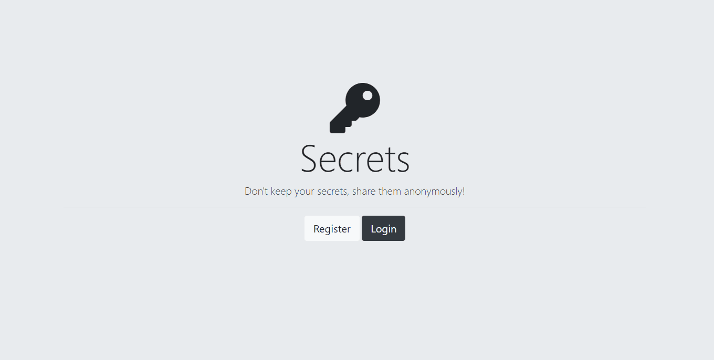

# Secrets
Secrets is an authentication project from Angela Yu's course "The Complete 2021 Web Development Bootcamp" (Udemy - The Brewing App). With this project, I learned about different levels of authentication and security, ultimately being able to implement Google OAuth 2.0.

## Extra feature
In the course Angela suggests that we try and find how to implement Facebook OAuth 2.0. I followed her advice and I implemented it on my own.

